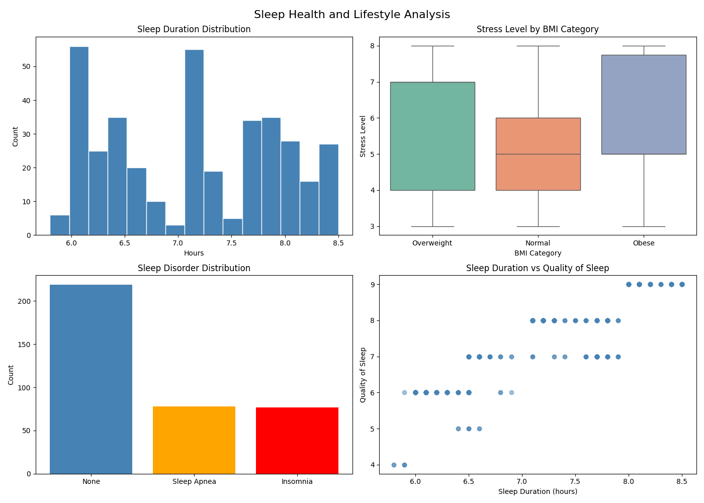

# Sleep Health and Lifestyle Analyzer

A data analysis project that explores factors affecting sleep quality using Python, SQL, and Machine Learning.

## Dataset
[Sleep Health and Lifestyle Dataset](https://www.kaggle.com/datasets/uom190346a/sleep-health-and-lifestyle-dataset) — 374 records, 13 variables including age, occupation, sleep duration, stress level, BMI, blood pressure, and sleep disorders.

## What This Project Does
- Loads and prepares raw data (splits Blood Pressure into Systolic/Diastolic, creates Sleep Efficiency variable, fixes BMI category inconsistencies)
- Stores cleaned data in a **SQLite database**
- Runs **SQL queries** to extract key statistics
- Visualizes data distributions and relationships
- Trains a **Logistic Regression** model to predict sleep quality

## Technologies
- Python
- SQL (MySQL)
- pandas
- matplotlib
- seaborn
- scikit-learn

## How to Run

Install dependencies:
```bash
pip install pandas matplotlib seaborn scikit-learn
```

Run the script:
```bash
python3 main.py
```

## Key Findings

**SQL Analysis:**
- Average sleep duration across all respondents: **7.13 hours**
- People with Overweight BMI have the highest average stress level (5.73), followed by Obese (5.70) and Normal (5.13)
- 219 people have no sleep disorder, while Sleep Apnea (78) and Insomnia (77) are almost equally distributed

**Visualizations:**
- Sleep duration shows two peaks around 6 and 7+ hours, suggesting two distinct groups
- Clear positive relationship between sleep duration and sleep quality — longer sleep consistently leads to higher quality scores
- Obese category shows the widest range of stress levels

**Logistic Regression Model:**
- Predicts whether a person has good or poor sleep quality based on sleep duration, physical activity, stress level, and age
- Achieved **96.46% accuracy** on test data
- Model limitation: due to class imbalance (very few poor sleep cases), the model struggles to identify class 0 (poor sleep) — a known challenge in imbalanced datasets

## Example Output

